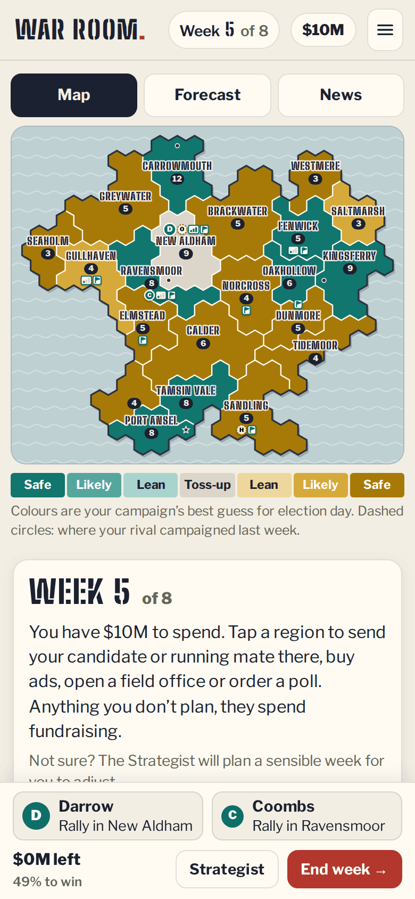
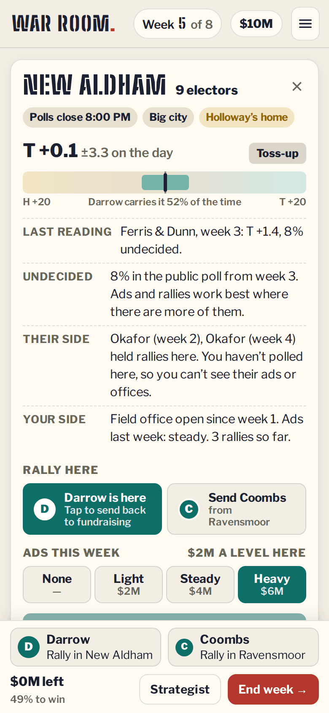
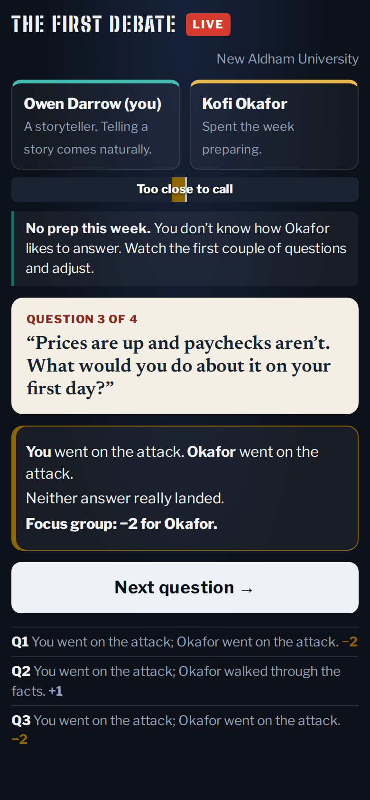
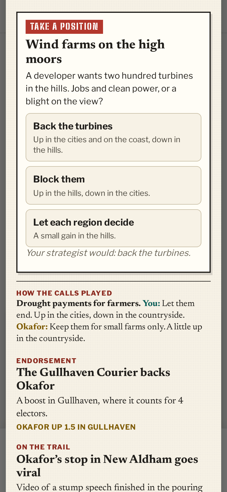
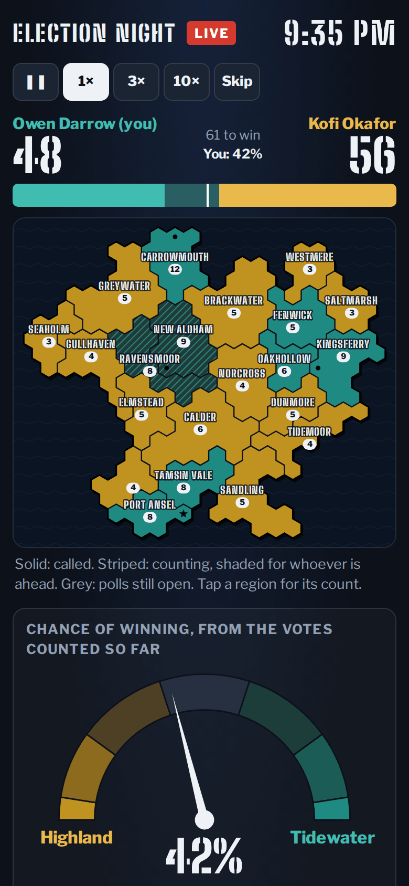
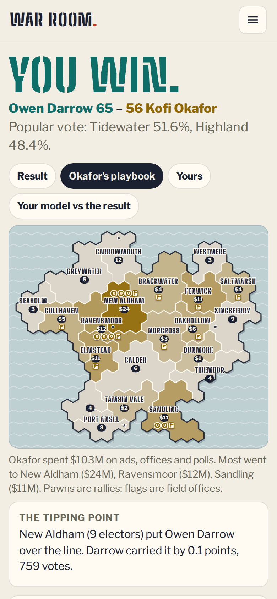

# War Room

**Play it: [junkdrawer.works/war-room](https://junkdrawer.works/war-room/)**

**An election campaign played like a board game, on the map of a country that doesn’t exist.** You have eight weeks to win the presidency of Aldermere, region by region. Each week you move your candidate and running mate around the map, buy ads, open field offices and pay for polls, while your rival does the same where you can’t see it. When a scandal breaks you decide how to answer it, you take sides on the issues, and you face your rival in two debates. Then election night comes in one batch of votes at a time.

<p align="center">
  
  &nbsp;
  
  &nbsp;
  
</p>
<p align="center">
  
  &nbsp;
  
  &nbsp;
  
</p>

## How it plays

- **The board.** Aldermere has 21 regions and 121 electors. Carry a region and you take all of its electors; 61 wins. It’s the same map every game, the way Risk’s board is, but every campaign shifts how the regions lean, and each candidate gets a bump at home.
- **Your pieces.** Send the candidate and the running mate to rallies (they spill over a little into the neighbouring regions) or leave them fundraising. Buy ads a region at a time, light, steady or heavy; the first level does the most, and city ads cost more. A field office adds a little every week until election day, so it pays to open them early. A poll costs $1M.
- **What you can’t see.** Your rival plans at the same time you do. You learn where their candidates went, and nothing else: their ads and field offices stay face down until you poll a region. The map shows your campaign’s best guess, which counts half of your own work until a poll confirms it and goes stale where nobody has polled in a while.
- **The forecast.** Your campaign runs the election 2,000 times from what it knows: your chance of winning, how many electors you might get, the regions lined up from safest to safest, and which one is most likely to tip it.
- **Your calls.** Monday’s paper usually needs an answer. When a scandal breaks, a candidate is caught on a hot mic, a plant closes, a river floods or a late surprise lands, you decide how your campaign responds, and there’s a call to make when it’s your rival in trouble too. Some answers are sure things and some are gambles (stand by your campaign chair and it may blow over, or get much worse), and a promise to show up somewhere only pays if your candidate goes. The next paper says how each call played, yours and your rival’s. The Strategist says what it would do.
- **Taking sides.** On quiet weeks an issue comes up (a rail line across the north, fishing quotas, farm payments, wind farms on the moors, city rents) and both campaigns take a position. Each one wins some regions and costs others. An issue can come back later, and changing your mind then costs you.
- **The debates.** After weeks 3 and 6. Four questions, and for each you pick how to answer: go on the attack, walk through the facts, pivot to your plan, or tell a story. They beat each other in a loop, some suit a question better, and each candidate has a natural style. You see how your rival answered only after you’ve answered, so without prep you learn their habits as you go; with prep you get a scouting report.
- **The news.** Endorsements, the economy, local anger, a late surprise most years and sometimes rain on election day. Your pollster’s private memo comes with it.
- **The rival.** It plans with the same strategist as your Strategist button: it works out what one more point in each region is worth to its chance of winning, then spends wherever that buys the most per dollar. On Easy it’s sloppy and the mood favours you; on Hard it has better data and the mood is against you.
- **Election night.** Polls close from east to west, regions count in batches, and a decision desk calls each one once the votes left can’t change it. City mail ballots are counted last, so early leads can melt. A needle shows your chance as the votes come in.
- **The morning after.** Every piece turned face up: the rival’s whole playbook region by region, yours, where your model was wrong, and the tipping point. “Challenge someone” sends a link to the same campaign, with the same rival and the same news.
- No account and no server. A campaign in progress and your record stay in your browser. It works offline and installs to a phone’s home screen.

## Running it

It’s a static site: plain HTML, CSS and JavaScript, with no build step.

```sh
npx serve .                   # or any static file server, then open the printed address
npm test                      # checks the rules in Node, then plays a campaign in Chromium (needs Playwright)
npm install                   # once, for the bundler and the screenshot tool's PNG compressor
node tools/screenshots.mjs    # redraws docs/*.png and og.png
node tools/make-icons.mjs     # redraws the PNG icons from icon.svg
npm run build                 # bundles everything into dist/war-room.html, one file you can send around
node dev/balance.mjs 100      # plays strategies against each other, to check the game is fair
node dev/calibrate.mjs 50     # checks the forecast is honest: when it says 70%, does that side win about 70%?
node dev/debates.mjs          # how much playing the debates well is worth
```

To put it online with GitHub Pages: **Settings → Pages → Build and deployment → Deploy from a branch**, then pick `main` and `/ (root)`.

### Files

- `js/country.js`: the map of Aldermere, grown from a fixed seed on a hex grid: coast, cities, regions, electors and how each region leans.
- `js/campaign.js`: the rules. The true state of the race, a week of campaigning, the polls, and what each side can know.
- `js/events.js`: the news, from endorsements and the economy to gaffes, scandals and the weather.
- `js/decisions.js`: your calls: the options each piece of news offers, the issues, and how each choice plays out.
- `js/debate.js`: the debates: the questions, the four ways to answer, and how an exchange is scored.
- `js/forecast.js`: the Monte Carlo forecast, tipping points and what a point in each region is worth.
- `js/ai.js`: the strategist, which plans the rival’s weeks and calls (and yours, when you ask). It gambles more when it’s behind.
- `js/night.js`: election night: when polls close, how the count comes in, and when the desk calls it.
- `js/ui/`: the screens (title, ticket, war room, paper, election night, result) and the SVG map and charts.
- `fonts/`: Libre Franklin, Big Shoulders Stencil and Newsreader (SIL Open Font License), served from here so nothing loads from elsewhere.
- `sw.js`: keeps a copy for playing offline.
- `test/`: the rules in Node, and a whole campaign played through the real page.
- `dev/`: tools used while building it: map previews, balance and calibration runs, a traced campaign.
